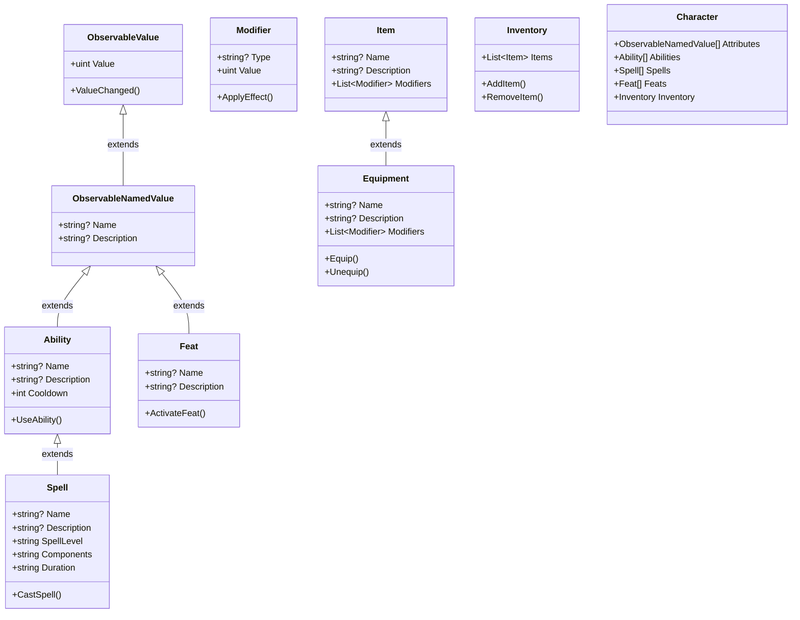

```mermaid
classDiagram
    class ObservableValue {
      +uint Value
      +ValueChanged()
    }
    class ObservableNamedValue {
      +string? Name
      +string? Description
    }
    ObservableValue <|-- ObservableNamedValue : extends
    class Modifier {
      +string? Type
      +uint Value
      +ApplyEffect()
    }
    class Ability {
      +string? Name
      +string? Description
      +int Cooldown
      +UseAbility()
    }
    ObservableNamedValue <|-- Ability : extends
    class Spell {
      +string? Name
      +string? Description
      +string SpellLevel
      +string Components
      +string Duration
      +CastSpell()
    }
    Ability <|-- Spell : extends
    class Feat {
      +string? Name
      +string? Description
      +ActivateFeat()
    }
    ObservableNamedValue <|-- Feat : extends
    class Item {
      +string? Name
      +string? Description
      +List~Modifier~ Modifiers
    }
    class Equipment {
      +string? Name
      +string? Description
      +List~Modifier~ Modifiers
      +Equip()
      +Unequip()
    }
    Item <|-- Equipment : extends
    class Inventory {
      +List~Item~ Items
      +AddItem()
      +RemoveItem()
    }
    class Character {
      +ObservableNamedValue[] Attributes
      +Ability[] Abilities
      +Spell[] Spells
      +Feat[] Feats
      +Inventory Inventory
    }

```